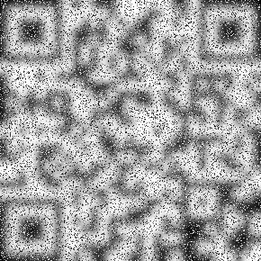

# Project 29 (30)

## Description

29 years ago the QR code was invented. 29 years later, we recovered this software license key for WSU Project #29. Unfortunately, time has not been kind to it. Can you recover the original software license key so we can launch project #29?



## Method
I used an online image blurring tool (https://onlinetools.com/image/blur-image) to blur the image of the qr code, removing a lot of the noise. This let my phone's camera read the qr code, giving me the flag.

## Flag
```
CAPTURETHEWU-CD95C8EE-874A-43EC-820B-D1B417087383
```