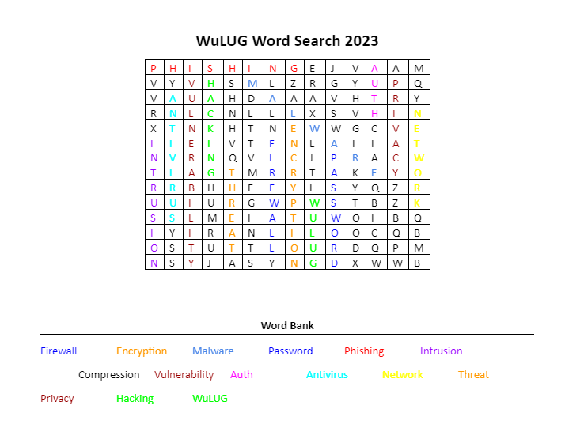

# Word Search (20)

## Description

Can you find the hidden flag?
[WuLUG_Word_Search_2023.zip](ChallengeFiles/WuLUG_Word_Search_2023.zip)

## Solution

When opening this the first time, I thought that the challenge had something to do with the word search itself, so I solved the word search.



The only word that was not in the grid was "Compression." This seemed like it was a hint so we started thinking that maybe this could be secretly a zip file. After randomly trying the command:
```zsh
unzip WuLUG_Word_Search_2023.docx
```
We got the following files:
```
Archive:  WuLUG Word Search 2023.docx
  inflating: [Content_Types].xml
  inflating: _rels/.rels
  inflating: docProps/app.xml
  inflating: docProps/core.xml
  inflating: word/_rels/document.xml.rels
  inflating: word/document.xml
  inflating: word/fontTable.xml
  inflating: word/settings.xml
  inflating: word/styles.xml
  inflating: word/theme/theme1.xml
  inflating: word/webSettings.xml
```

At first I was suprised, but after looking into it further, I discovered that .docx files are just zip files containing the files that make up the document.

After this, I used the following command to search for the flag in the documents.
```zsh
grep -ir wu .
```
This command searches for the term "wu" recursively "-r" and is case insensitive "-i" in the current directory. I got two results from "document.xml"
The first result was:
```xml
<!--CaptureTheWu-1809df72-8e96-485f-843b-2feec500a11f-->
```
This is an xml comment, so it would not be displayed in the document.
The second one contained the document contents which includes "wu" as it is mentioned in the word search.
I searched for "wu" as it is contained in the flag formats "CaptureTheWu-" and "CTFWU{}" I also searched for other terms like "flag" and "ctf" before this.

The flag, which was at the beginning of document.xml, was:
```
CaptureTheWu-1809df72-8e96-485f-843b-2feec500a11f
```
