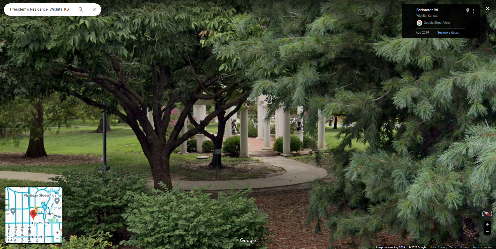

# Find WU (30)

## Description
One of Wu's favorite spots on campus is a secret garden that houses the art of Charles Grafly. Can you check the garden and see if Wu is hiding there? Well, you would have to find the garden first...

## Attempt

The main roadblock we ran into is to find what we were looking for, we found the garden, got multiple angles of it, but Wu wasnt anywhere and the name "Charles Grafley Sculpture Garden" wasn't the answer. Nothing stood out as the flag.

We found the sculpture garden to be next to President's Residence in a small garden. Also somewhat near the Wilner Auditorium.

Views of this area and the sculptures can be seen here:

[360Cities](https://www.360cities.net/image/charles-grafly-sculpture-garden-wichita-kansas)
[GoogleMapsClosest](https://www.google.com/maps/place/Wilner+Auditorium/@37.7169493,-97.2979416,3a,32.6y,239.98h,85.34t/data=!3m6!1e1!3m4!1s57uU-nI7SaFIntDKvzcbJQ!2e0!7i16384!8i8192!4m15!1m8!3m7!1s0x87bae2fb509da01f:0x610b3cdb883fa9c5!2sPresident's+Residence,+Wichita,+KS+67260!3b1!8m2!3d37.7160447!4d-97.2983785!16s%2Fg%2F1tl4dk27!3m5!1s0x87bae2e4b17a3663:0x50bd8617add62d5d!8m2!3d37.7163652!4d-97.2973658!16s%2Fg%2F11d_788mcl?entry=ttu)
Image of google maps street view

Wu does not appear in either.

We have lots of information but do not know what information the challenge is looking for. We found the garden, Wu does not appear.

We tried 
CTFWU{Charles Grafly Sculpture Garden}
CTFWU{No}
CTFWU{Yes}

The last two are supposed to answer the question in the description

-Hudson