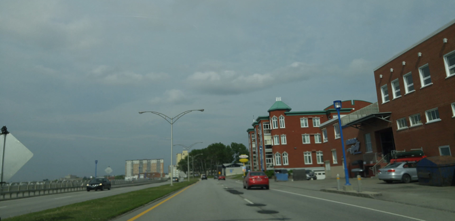

Lost Associate
10
We are trying to find a lost associate who may be headed into enemy territory. All they have sent you is this picture. Can you locate the highway and the city the blue car is located? We think they may be near there.

Attempted solutions:

Reverse image searched, found image origin from wikipedia commons. (Ontario Highway 41)

Locations wasn't specific enough so attempted to continue to solve using both the knowledge of what highway it was on and the noticable landmarks in the image.

No luck in the end. :(

