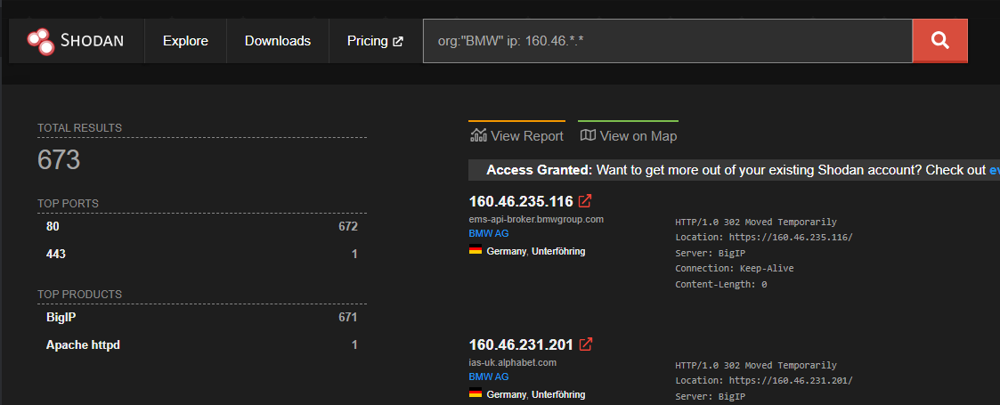
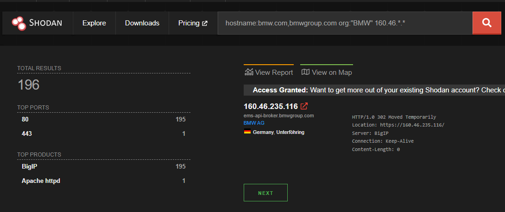
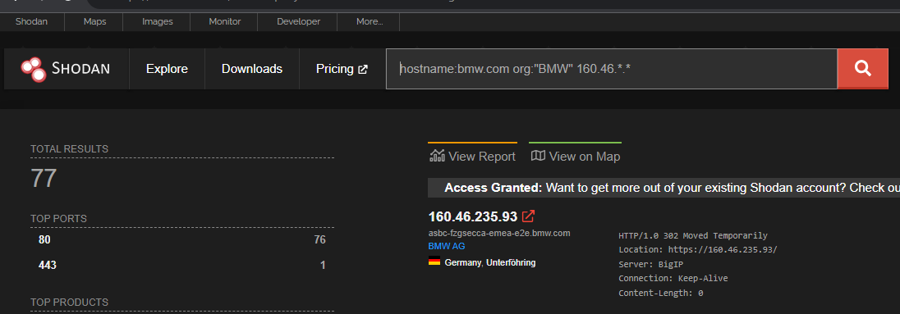

# Spoof Bank (10)

## Description

A certain German car manufacturer who has an IP address that starts with 160.46 has multiple domains ripe for spoofing. How many do they have in all?

## Attempts

I went to shodan.io and searched for the BMW org and ip of 160.46.*.*, Not correct.
I narrowed the search to also restrict hostnames to be "bmw.com, bmwgroup.com" as those are the two official ones listed, also not correct.
I narrowed the search even further to just the hostname "bmw.com", still not correct.
Also tried just "bmwgroup.com", also restricted to just germany, etc.

YORK notified us that the answer should be double digits and < 77. Not sure how we could narrow it down further. Possibly something that makes it "spoofable" as mentioned in the description, but I would think that would just be the hostname, which we already restricted.

Some of our searches and results:

-Hudson