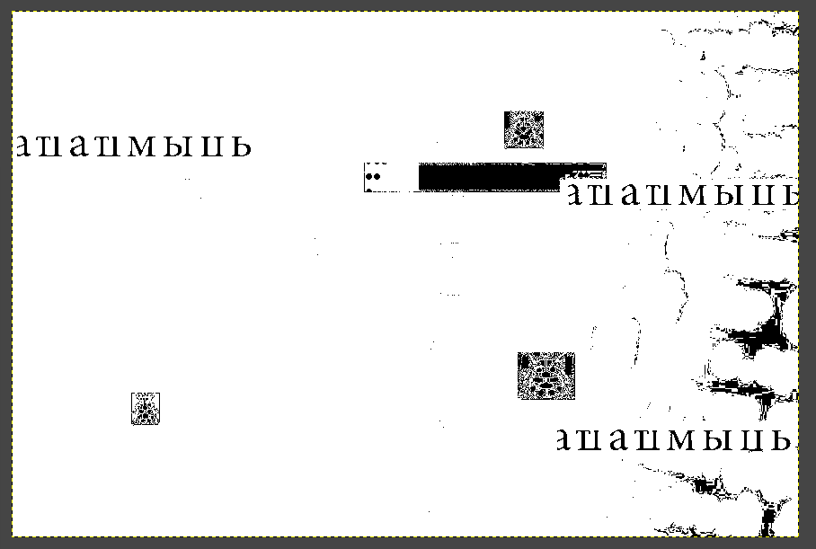
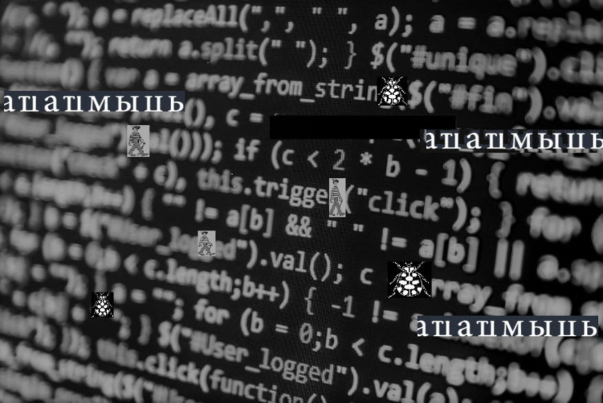

Sign of the Times
20
You are looking for a secret message that may be hidden in this nonsense. It is a sign you should heed.

Attempted solutions:

Adjusted all sorts of different visibility settings in hopes of finding a superimposed hidden message.

Only found a couple dots behind the black box, unaware of the significance.

Also tried decrypting the language using various image detection algorithms and also looking up the symbols. 

Checked meta data.

Ran through zsteg.

Viewed in Text Edit.

Ran through PNG Check.

No dice :(

